# bp_flutter_app

Aplikácia na správu úloh (task management) postavená na frameworku **Flutter**, ktorá kombinuje klasický zoznam úloh s **RPG systémom postavy** (role-playing game, hra na hrdinov). Plnenie úloh odmeňuje používateľa skúsenostnými bodmi (XP), zlatom a postupom na vyššie úrovne, pričom postavu je možné vizualizovať a prispôsobovať v zabudovanom **3D prehliadači**.

<p align="center">
  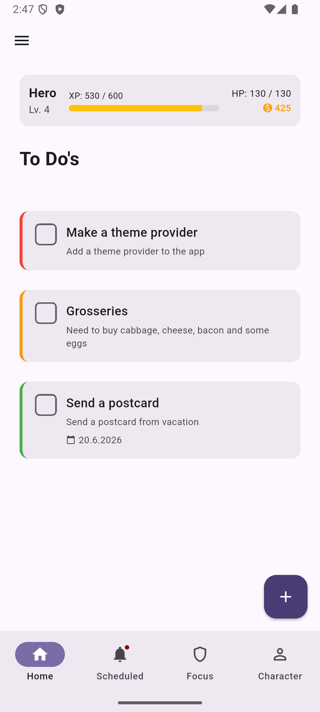
  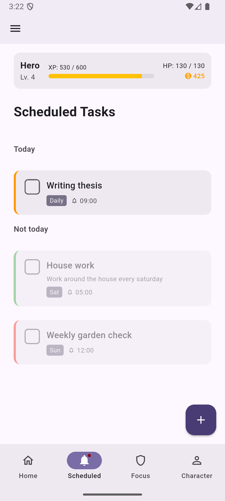
  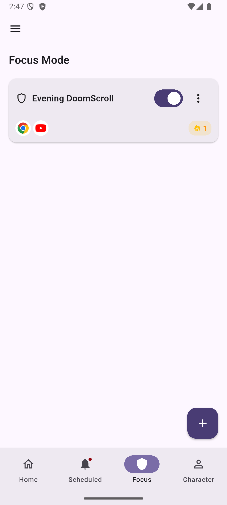
  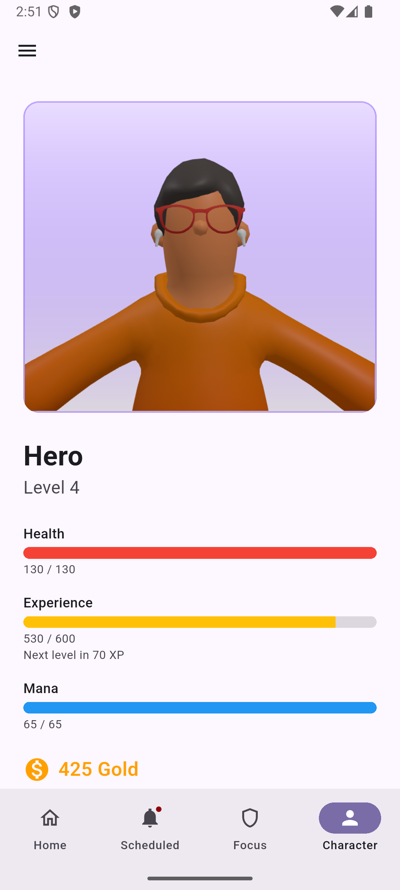
</p>

---

## Obsah

- [Prehľad a účel projektu](#prehľad-a-účel-projektu)
- [Kľúčové funkcie](#kľúčové-funkcie)
- [Architektúra](#architektúra)
  - [Správa stavu (state management)](#správa-stavu-state-management)
  - [Dátová vrstva (data layer)](#dátová-vrstva-data-layer)
  - [Štruktúra priečinkov](#štruktúra-priečinkov)
- [Naplánované úlohy (Scheduled Tasks)](#naplánované-úlohy-scheduled-tasks)
- [3D prehliadač postavy](#3d-prehliadač-postavy)
- [Focus Mode (režim sústredenia)](#focus-mode-režim-sústredenia)
- [Inštalácia a nastavenie](#inštalácia-a-nastavenie)
- [Príkazy na build, spustenie a testovanie](#príkazy-na-build-spustenie-a-testovanie)
- [Závislosti](#závislosti)
- [Návrhové rozhodnutia a kompromisy](#návrhové-rozhodnutia-a-kompromisy)
- [Snímky obrazovky](#snímky-obrazovky)

---

## Prehľad a účel projektu

`bp_flutter_app` je mobilná aplikácia na správu osobných úloh, ktorá zavádza herný (gamifikovaný) prvok do bežnej produktivity. Používateľ si vytvára jednorazové aj opakujúce sa úlohy, plní ich a za splnenie získava odmeny pre svoju RPG postavu. Cieľom je zvýšiť motiváciu k pravidelnému plneniu povinností pomocou vizuálnej spätnej väzby (postup úrovne, zbieranie výbavy) a mechaniky sérií (streak).

Aplikácia je organizovaná **feature-first** (podľa funkcií), používa **Provider** na správu stavu a **Isar** ako lokálnu NoSQL databázu. Časť funkcionality, konkrétne **Focus Mode** (blokovanie aplikácií), je dostupná len na platforme Android, keďže sa opiera o natívny kód v jazyku Kotlin.

---

## Kľúčové funkcie

| Funkcia | Popis |
|---|---|
| Správa úloh (To-Do) | Vytváranie, úprava, plnenie a mazanie jednorazových úloh s nastaviteľnou obťažnosťou (difficulty) a termínom (due date). |
| Naplánované úlohy (Scheduled Tasks) | Opakujúce sa úlohy s rozšírenými vzormi opakovania: **Daily** (každých N dní), **Weekly** (vybrané dni v týždni) a **Monthly** (podľa dátumu alebo podľa poradového dňa v týždni). |
| Lokálne notifikácie | Pripomienky pre naplánované úlohy s explicitným časom a voliteľným predstihom (minutesBefore). Aktuálne **iba pre Android**. |
| RPG systém postavy | Skúsenostné body (XP), zlato (gold), úrovne (level), zdravie (health) a mana. Splnenie úlohy udeľuje odmenu, nesplnenie spôsobuje poškodenie postavy. |
| 3D prehliadač postavy | Interaktívna 3D scéna (Three.js) s možnosťou prispôsobenia vzhľadu, výbavy a akcentovej farby. |
| Focus Mode (Android) | Blokovanie rušivých aplikácií podľa časových okien, so sériami (streak), prísnym (strict) režimom a časovanými intervalmi výnimiek. |
| Archív | Prehľad splnených úloh s možnosťou ich obnovenia bez poškodenia postavy. |
| Odmeňovací titulok  | Animované RPG-štýlové oznámenie (`RewardToast`) o získanom XP, zlate a prípadnom postupe na vyššiu úroveň. |

<p align="center">
  
</p>

---

## Architektúra

Aplikácia je task-management nástroj s RPG systémom postavy. Stav sa spravuje cez **Provider**, perzistencia dát beží na lokálnej NoSQL databáze **Isar**.

### Tok pri spustení (startup flow)

Spúšťacia logika sídli v `lib/main.dart` a prebieha v tomto poradí:

1. `IsarService.init()` otvorí databázu Isar.
2. `NotificationService().init()` nastaví lokálne notifikácie.
3. `CharacterNotifier` sa vytvorí a načíta z databázy ešte pred `runApp`.
4. `ScheduledTaskRepository` sa vytvorí a jeho `init()` sa zavolá (await) pred prvým vykreslením snímky: spustí denný reset, dorovnanie sérií (streak catch-up) a preplánovanie všetkých notifikácií.
5. Zaregistruje sa päť `ChangeNotifierProvider`-ov: `CharacterNotifier` (cez `.value()`), `TaskRepository(characterNotifier)`, `ScheduledTaskRepository` (cez `.value()`), `FocusModeProvider(characterNotifier)` a `ThemeProvider`.

`MainApp` je `StatelessWidget`. Blokovacia obrazovka Focus Mode je riešená výhradne natívnym Android overlayom, preto netreba `MethodChannel` listener ani `navigatorKey`.

### Navigácia

Hlavná navigácia (`lib/pages/app_main_page.dart`) používa spodnú lištu (bottom navigation) so štyrmi záložkami:

| Index | Záložka | Stránka |
|---|---|---|
| 0 | To-Do | `ToDoPage` |
| 1 | Scheduled | `ScheduledTaskPage` |
| 2 | Focus | `FocusModePage` |
| 3 | Character | `CharacterScreen` |

`Drawer` (bočné menu) sprístupňuje `ArchivePage` a `SettingPage` cez `Navigator.push`.

### Správa stavu (state management)

Na správu stavu sa používa balík **Provider**. Kľúčový je vzor, kedy **RPG logika žije v dátovej vrstve, nie v UI widgetoch**:

- `CharacterNotifier` (`ChangeNotifier`) vlastní celú RPG logiku: `completeTask(difficulty)` vracia objekt `TaskReward`, `failTask(difficulty)`, postup úrovne, smrť a reset postavy. Po každej zmene perzistuje do Isar.
- `CharacterNotifier` sa injektuje do oboch repozitárov úloh cez konštruktor, takže výpočet odmien a poškodenia prebieha na úrovni dát.
- Repozitáre (`TaskRepository`, `ScheduledTaskRepository`) sú tiež `ChangeNotifier` a držia okrem perzistentných dát aj prechodný stav formulárov (overlay) cez enum `EditMode`. Konzumenti čítajú polia formulára (napr. `repo.overlayDifficulty`) priamo z repozitára namiesto lokálneho stavu widgetu.
- `FocusModeProvider` (`ChangeNotifier`) vlastní stav Focus Mode a komunikuje s natívnou vrstvou.
- `ThemeProvider` spravuje motív (theme) aplikácie.

### Dátová vrstva (data layer)

Perzistencia stojí na **Isar**, lokálnej NoSQL databáze. Modely sú triedy s anotáciou `@Collection()` a ku každej patrí vygenerovaný súbor `.g.dart`.

> **Dôležité:** Po každej úprave modelu s `@Collection()` treba znova spustiť generátor schémy (`dart run build_runner build --delete-conflicting-outputs`). Pridanie novej schémy si vyžaduje čistú reinštaláciu aplikácie, pretože **Isar nemá migrácie**.

| Trieda | Umiestnenie | Účel |
|---|---|---|
| `IsarService` | `core/services/` | Singleton, ktorý otvára a sprístupňuje inštanciu Isar so schémami `TaskSchema`, `ScheduledTaskSchema`, `CharacterSchema`, `FocusGroupSchema`, `DailyComplianceSchema`. |
| `Task` | `features/tasks/models/` | `@Collection` jednorazovej úlohy. |
| `ScheduledTask` | `features/scheduled_tasks/models/` | `@Collection` opakujúcej sa úlohy (v2). |
| `Character` | `features/character/models/` | Singletonový riadok (`Id id = 1`) s atribútmi postavy a 3D prispôsobenia. |
| `FocusGroup` | `features/focus_mode/models/` | `@Collection` skupiny blokovaných aplikácií. |
| `FocusTimeWindow` | `features/focus_mode/models/` | `@embedded` objekt v rámci `FocusGroup` (časové okno). |
| `DailyCompliance` | `features/focus_mode/models/` | `@Collection` denného sledovania odmien Focus Mode, unikátny index na `dateKey`. |
| `TaskReward` | `features/tasks/models/` | Obyčajná dátová trieda (nie Isar): `xpAwarded`, `goldAwarded`, `leveledUp`. |

Vybrané vzory dátovej vrstvy:

- Všetky zápisy do Isar prebiehajú v rámci `_isar.writeTxn(...)`.
- `toggleTask(Id id)` vracia `Future<TaskReward?>`: nenulové pri prechode do stavu splnené, `null` pri odškrtnutí. UI po `await` a kontrole `mounted` zobrazí `RewardToast.show(context, reward)`.
- **Podpora archívu:** každý repozitár drží `currentTasks` aj `archivedTasks`; `fetchTasks()` ich delí v pamäti. Pre `TaskRepository` je archivované `isDone`. Po redizajne v2 sú všetky naplánované úlohy opakujúce sa, preto je `archivedTasks` v `ScheduledTaskRepository` vždy prázdne (pole sa ponecháva kvôli kompatibilite API s `ArchivePage`).
- `restoreTask(Id id)` nastaví `isDone = false` bez volania `failTask()`, teda **bez vrátenia XP/zlata a bez poškodenia postavy**. Používa ho výhradne `ArchivePage`.

<p align="center">
  
</p>

### Štruktúra priečinkov

Kód v `lib/` je organizovaný **feature-first**: každá funkcia vlastní svoje modely, providery, stránky, widgety a (kde treba) služby.

```
lib/
├── main.dart
├── core/
│   ├── services/        # isar_service.dart, notification_service.dart
│   └── theme/           # theme.dart, theme_provider.dart
├── features/
│   ├── tasks/           # models, providers (task_repository), pages (to_do_page),
│   │                    # widgets (to_do_tile, edit_task_overlay, difficulty_picker,
│   │                    # due_date_picker)
│   ├── scheduled_tasks/ # models, providers, pages (scheduled_task_page,
│   │                    # schedule_editor_page), widgets, utils
│   ├── character/       # models (character, character_customization),
│   │                    # providers (character_notifier), pages (character_screen),
│   │                    # widgets (character_3d_viewer, customization_panel,
│   │                    # character_summary_widget, stat_bar_widget)
│   ├── focus_mode/      # models, providers (focus_mode_provider),
│   │                    # services (focus_mode_service), pages, widgets
│   └── archive/         # pages (archive_page) — len zobrazenie, bez modelov/providerov
├── shared/
│   └── widgets/         # custom_check_box, dialog_box, reward_toast
└── pages/               # app_main_page (shell), settingpage (legacy umiestnenie)
```

Poznámky k štruktúre:

- `lib/pages/` je **legacy** (staré) umiestnenie a aktuálne hostí `app_main_page.dart` a `settingpage.dart`.
- `shared/widgets/reward_toast.dart` je zámerne medzifunkčný (cross-feature), používajú ho `tasks` aj `scheduled_tasks`.
- Priečinky funkcií môžu vynechať podpriečinky, ktoré nepotrebujú (napr. `archive/` má len `pages/`).

| Vrstva | Priečinok | Zodpovednosť |
|---|---|---|
| Vstupný bod | `lib/main.dart` | Inicializácia služieb a registrácia providerov. |
| Jadro | `lib/core/` | Zdieľané služby (Isar, notifikácie) a téma. |
| Funkcie | `lib/features/` | Samostatné funkčné celky (feature-first). |
| Zdieľané | `lib/shared/` | Medzifunkčné widgety. |
| Legacy | `lib/pages/` | Shell aplikácie a staršie stránky. |

---

## Naplánované úlohy (Scheduled Tasks)

Funkcia `features/scheduled_tasks/` rieši opakujúce sa úlohy. Model `ScheduledTask` (v2) je `@Collection` a stojí na štyroch enumeráciách:

| Enum | Hodnoty | Účel |
|---|---|---|
| `RecurrenceType` | `daily`, `weekly`, `monthly` | Základný režim opakovania. |
| `MonthlySubMode` | `byDate`, `byOrdinalWeekday` | Pod-režim mesačného opakovania. |
| `MonthlyOrdinal` | `first`, `second`, `third`, `fourth`, `last` | Poradie pre "poradový deň v týždni". |
| `ReminderMode` | `none`, `atTime`, `minutesBefore`, `both` | Spôsob pripomienky (`none` je platná voľba, v UI označená "Off"). |

### Vzory opakovania

- **Daily** (každých N dní) cez `dailyInterval`, výpočet sa kotví na `anchor date`.
- **Weekly** na vybraných dňoch `weeklyDays` (1 = pondelok … 7 = nedeľa).
- **Monthly** v dvoch pod-režimoch:
  - `byDate` používa `monthlyDayOfMonth` (ak cieľový deň prekročí dĺžku mesiaca, použije sa posledný deň mesiaca),
  - `byOrdinalWeekday` kombinuje `monthlyOrdinal` × `monthlyWeekday` (napr. "tretí piatok").

Jediným zdrojom pravdy je čistý predikát `task.isActiveOn(DateTime)`, ktorý používa sekcionovanie stránky, šedenie dlaždíc, dorovnanie sérií (streak catch-up) aj plánovanie notifikácií.

### Série (streak) a denný reset

Každá úloha sleduje `streak`, `lastStreakDate` a `lastCompletedDate` pre po sebe idúce splnenia v "on-day" dňoch. `ScheduledTaskRepository.init()` sa volá (await) pri štarte z `main.dart` a vykoná:

1. denný reset (ak `isDone && lastCompletedDate < dnes` → `isDone = false`),
2. dorovnanie série (ak je dnes "on-day" a predchádzajúci "on-day" bol vynechaný → `streak = 0`),
3. `fetchTasks()`,
4. `rescheduleAllNotifications()`.

> **Pozn.:** Po redizajne v2 sú všetky naplánované úlohy opakujúce sa (`RecurrenceType.none` bol odstránený), preto je `archivedTasks` v `ScheduledTaskRepository` vždy prázdne. Pole zostáva kvôli kompatibilite API s `ArchivePage`.

### Notifikácie (horizon-based plánovač)

`ScheduledTaskNotifications` plánuje lokálne notifikácie pomocou **horizon-based** prístupu: vypočíta najbližších 30 aktívnych dátumov cez `task.upcomingActiveDates(now)` a každý naplánuje samostatne (bez `DateTimeComponents`, ktoré nevedia vyjadriť "každých N dní" ani "poradový deň v týždni"). Rozsah ID na úlohu: `task.id * 1000 + [0..29]` pre čas notifikácie, `+ 500 + [0..29]` pre predstih; `cancel(taskId)` čistí celý rozsah 60 ID. Notifikácie používajú explicitný `notificationHour` / `notificationMinute` (oddelené od termínu) a voliteľný `minutesBefore` (predvolene 15). Plánovanie je v `saveOverlay()` obalené try-catch, takže úloha sa uloží a overlay sa zavrie aj pri zlyhaní notifikácie.

### UI

- `ScheduledTaskPage` delí `currentTasks` na sekcie **Today** / **Not today** podľa `task.isActiveOn(today)`. Dlaždice v "off-day" zostávajú plne interaktívne (editovateľné aj splniteľné); splnenie "off-day" úlohy udelí XP/zlato, ale **nemení polia série**.
- `RecurrencePicker` je komponovaný editor (prepínač Daily/Weekly/Monthly → pod-editor) s presetmi pre týždeň (Weekdays/Weekends/Every day).
- `ReminderPicker` ponúka výber času (`showTimePicker`) a pole pre minúty predstihu.
- `scheduled_task_descriptions.dart` (`utils/`) generuje živé inline popisy pod pickermi (`recurrenceSummaryFrom(...)`, `notificationSummaryFrom(...)`) a kompaktný odznak `recurrenceShortBadge(task)`.
- `ScheduledTaskTile` zobrazuje na "off-day" obalenie cez `Opacity(0.5)`, amber odznak série (ak `streak > 0`), kompaktný odznak opakovania a odznak času notifikácie.

Vytváranie a úprava naplánovanej úlohy prebieha v paneli `ScheduledTaskOverlay`, ktorý kombinuje `RecurrencePicker` a `ReminderPicker` so živými inline popismi pod nimi.


<p align="center">
  
</p>

Jednotlivé režimy `RecurrencePicker`-a :

<p align="center">
  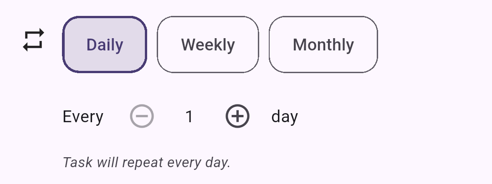
  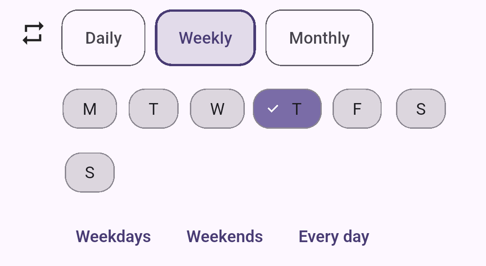
  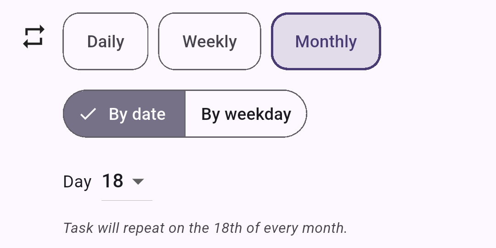
</p>

Jednotlivé režimy `ReminderPicker` : 
<p align="center">
  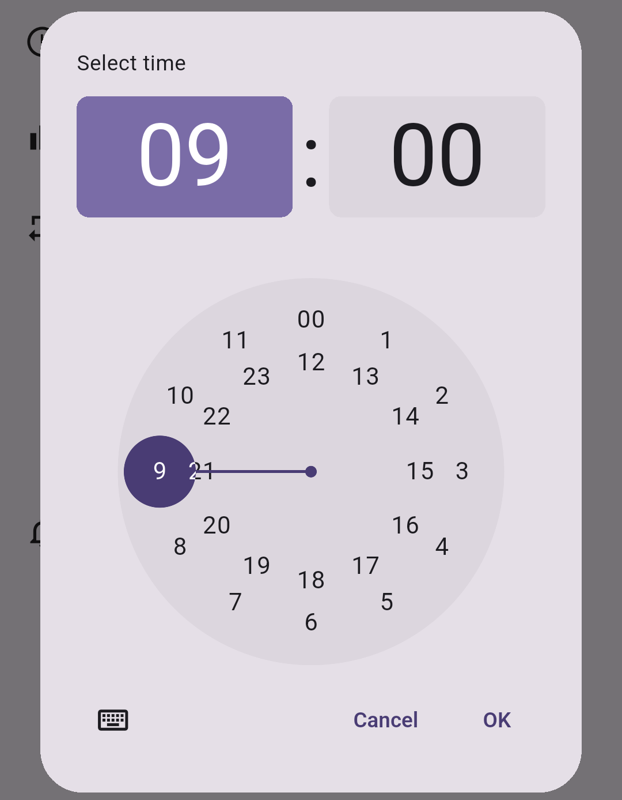
</p>

`ReminderPicker` (`widgets/reminder_picker.dart`) ponúka štyri režimy ako sériu prepínacích tlačidiel. Zvolený režim riadi, ktoré polia sa zobrazia a koľko notifikácií sa naplánuje. Čas notifikácie (`notificationHour` / `notificationMinute`) je oddelený od termínu úlohy a vyberá sa cez `showTimePicker`; pole predstihu používa `minutesBefore` (predvolene 15).

| Režim | Štítok v UI | Zobrazené polia | Správanie notifikácie |
|---|---|---|---|
| `none` | Off | žiadne | Žiadne notifikácie. |
| `atTime` | At time | výber času | Notifikácia presne v zvolenom čase. |
| `minutesBefore` | Before | výber času + pole minút | Notifikácia `minutesBefore` minút pred zvoleným časom. |
| `both` | Both | výber času + pole minút | Dve notifikácie: v zvolenom čase **aj** `minutesBefore` minút pred ním. |

Pole minút predstihu sa zobrazí len v režimoch **Before** a **Both** (`showMinutesField`); pole výberu času sa zobrazí vo všetkých režimoch okrem **Off** (`showTimeField`). Pod pickerom beží živý inline popis z `notificationSummaryFrom(...)` (napr. „You will be notified at 09:00 and 15 min before.").

<p align="center">
  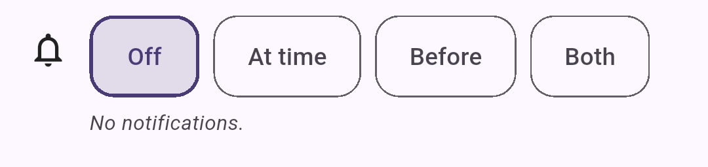
  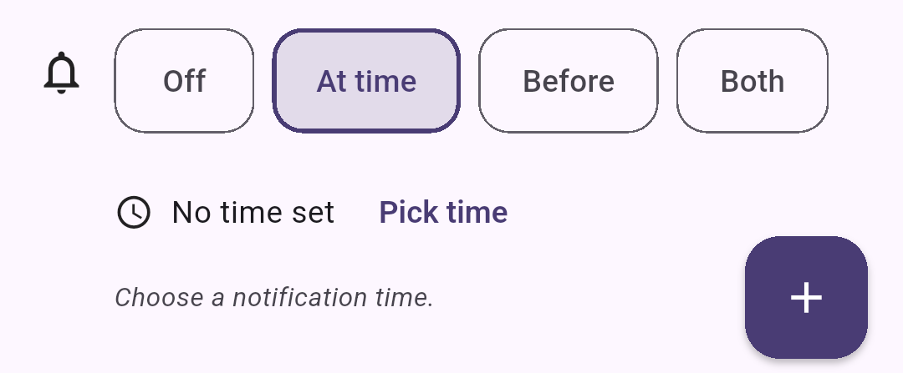
</p>
<p align="center">
  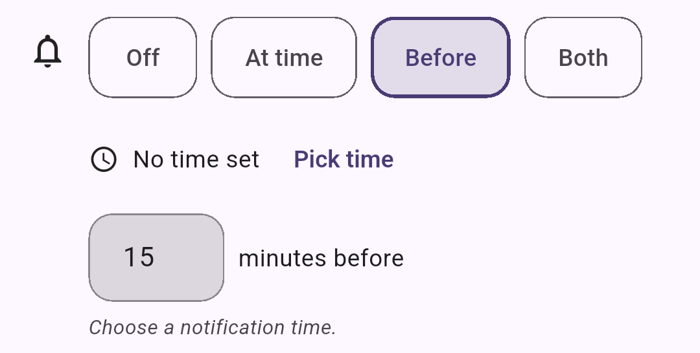
  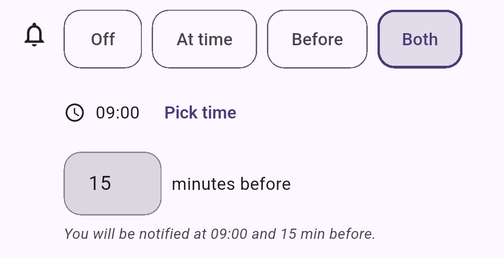
</p>


---

## 3D prehliadač postavy

Funkcia `features/character/` zobrazuje 3D model postavy a umožňuje jeho prispôsobenie.

**Renderovací stack:** balík `flutter_inappwebview` hostí vlastnú scénu Three.js načítanú z `assets/character/viewer/viewer.html`. Samotný Three.js sa načítava z CDN (jsdelivr) cez ES-module import-map. V scéne existuje jedna kamera, jedna sada svetiel a telo (body) GLB v koreni scény; každý nasadený kus výbavy je **rodičovsky pripojený k telu** (parented to body), takže centrovanie a posun na zem sa naň automaticky prenášajú.

**Prenos GLB (bytes-over-bridge):** Dart načíta GLB cez `rootBundle.load(path)`, zakóduje ho do base64 a odošle do JS cez `controller.callAsyncJavaScript(...)`. JS dekóduje base64 na `ArrayBuffer` a použije `loader.parse(...)`. Nepoužíva sa HTTP server, natívny kód ani vlastná URL schéma.

**Rozloženie assetov:**

| Cesta | Obsah |
|---|---|
| `assets/character/skins/*.glb` | Jeden súbor na každý skin (vzhľad). |
| `assets/character/equipment/*.glb` | Jeden súbor na každý kus výbavy. |
| `assets/character/viewer/{viewer.html, viewer.js}` | Hostiteľská stránka a logika scény. |

**Register (`models/character_customization.dart`):** čistý Dart (bez Isar). Definuje enum `EquipmentSlot` (12 hodnôt: hairstyle, glasses, headPhones, shirt, outwear, gloves, pants, shoe, head, chest, weapon, offHand), `EquipmentItem`, `SkinOption` a `CharacterAssetRegistry`. Pridanie výbavy je záležitosťou jedného riadku pomocou pomocníka `_e(slot, id, name, icon, {assetPath})`.

> **Upozornenie na zachytenie gest:** widget prehliadača deklaruje `gestureRecognizers` a má zapnuté `useHybridComposition: true`. Voľby `disableHorizontalScroll` / `disableVerticalScroll` sa **nesmú** nastaviť, inak natívny `OnTouchListener` pohltí dotyky skôr, než ich uvidí stránka. Canvas vo `viewer.html` má `touch-action: none`, čo je nutné, aby `OrbitControls` mohli prevziať dotyky.

<p align="center">
  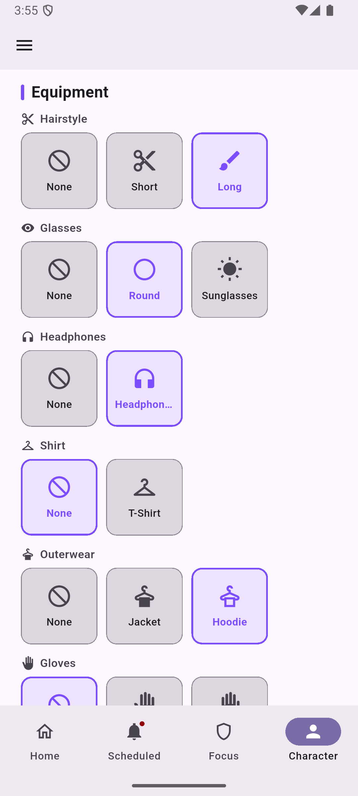
</p>

---

## Focus Mode (režim sústredenia)

> **Iba Android.** Funkcia sa opiera o natívny kód v jazyku Kotlin a platform channels (kanály medzi Flutter a natívnou vrstvou).

Focus Mode umožňuje blokovať rušivé aplikácie počas definovaných časových okien. Kľúčové natívne komponenty:

- `FocusBlockingService.kt` je Android foreground service (popredná služba), ktorý každých 1,5 s prehľadáva `UsageStatsManager`. Pri zistení blokovanej aplikácie počas aktívneho okna zobrazí natívny celoplošný overlay (`TYPE_APPLICATION_OVERLAY`) s rozhraním "Take a breath", indikátorom série a bodkami intervalov (pip dots).
- `MainActivity.kt` obsluhuje platform channel `com.example.bp_flutter_app/focus_mode` (napr. `getInstalledApps`, kontroly oprávnení, ovládanie blokovacej služby, `updateBlockedApps`, `updateScheduleJson`, `consumeNativeBypasses`, `consumeNativeIntervals`, `goToHomeScreen`).
- `EndOfDayAlarmReceiver.kt` je `BroadcastReceiver` plánovaný cez `AlarmManager.setRepeating()` na polnoc; samotné vyhodnotenie odmeny beží pri ďalšom spustení aplikácie.

**Vyžadované oprávnenia Android:** `QUERY_ALL_PACKAGES`, `PACKAGE_USAGE_STATS`, `FOREGROUND_SERVICE`, `FOREGROUND_SERVICE_SPECIAL_USE`, `SYSTEM_ALERT_WINDOW`.

Časované intervaly sú "zadarmo" (nepočítajú sa ako bypass pre sériu ani odmenu). Naraz môže byť aktívny interval len jednej skupiny (single-interval model).

Skupiny sa spravujú v paneli `FocusGroupOverlay`, ktorý má tri režimy riadené enumom `FocusEditMode`: `createGroup`, `editGroup` a `viewGroup` (len na čítanie, všetky vstupy sú deaktivované). Výber blokovaných aplikácií prebieha cez `AppPickerDialog` (celoobrazovkový vyhľadávací dialóg s ikonou, názvom a názvom balíka).

<p align="center">
  
  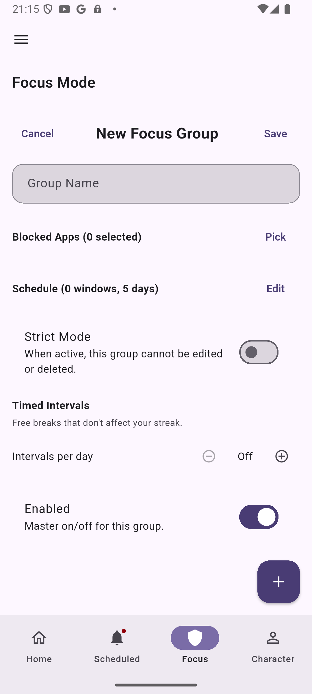
  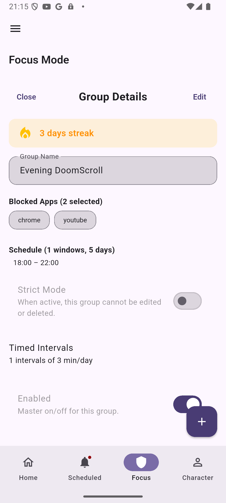
</p>
<p align="center">
  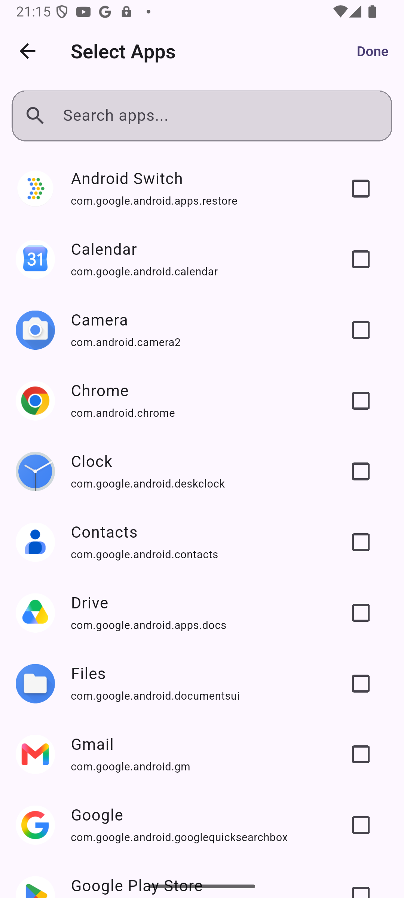
</p>


---

## Inštalácia a nastavenie

### Predpoklady

- Nainštalovaný **Flutter SDK** (Dart SDK `^3.9.2`, viď `pubspec.yaml`).
- Pre Android build: Android SDK a nakonfigurované zariadenie alebo emulátor.

> **Pripomienka platformy:** Focus Mode a lokálne notifikácie sú **Android-only**. Na iných platformách tieto funkcie nie sú dostupné.

### Kroky

```bash
# 1. Klonovanie repozitára
git clone <url-repozitara>
cd bp_flutter_app

# 2. Stiahnutie závislostí
flutter pub get

# 3. (Pri prvej zmene modelov s @Collection) vygenerovanie schém Isar
dart run build_runner build --delete-conflicting-outputs

# 4. Spustenie aplikácie
flutter run
```

---

## Príkazy na build, spustenie a testovanie

```bash
# Stiahnutie závislostí
flutter pub get

# Spustenie aplikácie
flutter run

# Build Android APK
flutter build apk

# Lint / statická analýza
flutter analyze

# Spustenie testov
flutter test

# Spustenie jedného testovacieho súboru
flutter test test/path/to/test_file.dart

# Regenerácia schém Isar (nutné po každej zmene modelu s @Collection)
dart run build_runner build --delete-conflicting-outputs

# Sledovací (watch) režim pre generovanie kódu
dart run build_runner watch --delete-conflicting-outputs
```

---

## Závislosti

### Produkčné závislosti

| Balík | Verzia | Účel |
|---|---|---|
| `flutter` | SDK | Základný framework. |
| `flutter_slidable` | `^4.0.3` | Posuvné akcie v zoznamoch (slide-to-delete). |
| `isar` | `^3.1.0+1` | Lokálna NoSQL databáza. |
| `isar_flutter_libs` | `^3.1.0+1` | Natívne knižnice Isar pre Flutter. |
| `path_provider` | `^2.1.5` | Prístup k cestám súborového systému (umiestnenie databázy). |
| `provider` | `^6.1.5+1` | Správa stavu. |
| `flutter_local_notifications` | `^17.2.4` | Lokálne notifikácie (Android). |
| `timezone` | `^0.9.4` | Práca s časovými zónami pri plánovaní notifikácií. |
| `installed_apps` | `^1.5.0` | Zoznam nainštalovaných aplikácií pre Focus Mode. |
| `android_alarm_manager_plus` | `^4.0.4` | Plánovanie Android alarmov (end-of-day). |
| `flutter_inappwebview` | `^6.1.5` | WebView hostiaci 3D scénu Three.js. |
| `shared_preferences` | `^2.3.2` | Ľahká perzistencia (most pre natívne udalosti Focus Mode). |

### Vývojové závislosti (dev_dependencies)

| Balík | Verzia | Účel |
|---|---|---|
| `flutter_test` | SDK | Testovací framework. |
| `flutter_lints` | `^5.0.0` | Pravidlá statickej analýzy. |
| `isar_generator` | `^3.1.0+1` | Generátor schém Isar (`.g.dart`). |
| `build_runner` | `^2.4.13` | Spúšťač generovania kódu. |

Deklarované balíky assetov (`pubspec.yaml`): `assets/character/skins/`, `assets/character/equipment/`, `assets/character/viewer/`.

---

## Návrhové rozhodnutia a kompromisy

- **Feature-first organizácia.** Kód je členený podľa funkcií, nie podľa technických vrstiev. To drží súvisiace modely, providery a widgety pohromade a uľahčuje pridávanie nových funkcií.
- **RPG logika v dátovej vrstve.** `CharacterNotifier` sa injektuje do repozitárov, čím sa herná logika udržiava mimo UI widgetov a centralizuje na jednom mieste.
- **Isar bez migrácií.** Isar nepodporuje migrácie schém, preto pridanie novej `@Collection` vyžaduje čistú reinštaláciu. Filtrovanie archívu prebieha v pamäti pri každom `fetchTasks()` (na `isDone` nie je `@Index()`), pretože osobné zoznamy úloh sú dostatočne malé a pridanie indexu by si vynútilo rebuild schémy a reinštaláciu.
- **Voľba renderovacieho stacku pre 3D prehliadač.** Doložené dôvody zo zdrojov:
  - `model_viewer_plus` renderuje jeden GLB na widget; vrstvenie viacerých widgetov rozsynchronizuje kamery, čo spôsobuje drift. Potrebná bola **jedna scéna s viacerými meshmi**, ktorú `<model-viewer>` neposkytuje.
  - `webview_flutter` neexponuje `setAllowFileAccessFromFileURLs`, ktoré projekt potrebuje; `flutter_inappwebview` áno.
  - Načítavanie cez URL je neživotaschopné, pretože moderný Chromium tvrdo blokuje `fetch()` proti `file://` URL. Preto sa GLB prenáša ako bajty cez most (bytes-over-bridge).
- **`INTERNET` oprávnenie pre 3D prehliadač.** `AndroidManifest.xml` vyžaduje `INTERNET`, lebo import-map sťahuje Three.js z CDN. Plne offline režim by si vyžiadal zrkadlenie knižníc Three.js do `assets/character/viewer/lib/` a prepísanie ciest v import-map.
- **Akcentová farba je len UI.** Tónuje okraj a gradient prehliadača a zvýraznenie výberu; samotný 3D model nerefarbí (to by si vyžiadalo prácu s materiálmi/shadermi GLB).
- **Horizon-based plánovač notifikácií.** `ScheduledTaskNotifications` počíta najbližších 30 aktívnych dátumov cez `task.upcomingActiveDates(now)` a plánuje každý zvlášť, pretože `DateTimeComponents` nevie vyjadriť vzory "každých N dní" ani "poradový deň v týždni".
- **Natívny overlay pre Focus Mode.** Blokovacia obrazovka beží ako natívny Android overlay priamo zo služby, vďaka čomu na strane Flutter netreba `MethodChannel` listener ani `navigatorKey`.

---

## Snímky obrazovky

Navrhované snímky používajú konvenciu cesty `docs/screenshots/<nazov>.png`. Pre každú snímku je uvedený názov súboru, čo má zobrazovať a do ktorej sekcie patrí. Navrhujú sa len snímky pre funkcie, ktoré v aplikácii reálne existujú.

| Súbor | Čo má zobrazovať | Sekcia |
|---|---|---|
| `docs/screenshots/app-overview.png` | Celkový pohľad na aplikáciu so spodnou navigáciou (4 záložky). | Úvod / hlavička |
| `docs/screenshots/todo-page.png` | `ToDoPage` so zoznamom jednorazových úloh, farebným ľavým okrajom podľa obťažnosti a kartou postavy (`CharacterSummaryWidget`). | Kľúčové funkcie |
| `docs/screenshots/character-screen.png` | `CharacterScreen` s 3D prehliadačom, menom, úrovňou a stavovými lištami (zdravie, XP, mana, zlato). | Architektúra / dátová vrstva |
| `docs/screenshots/customization-panel.png` | `CustomizationPanel` so sekciami Appearance (skin), Equipment a Accent color. | 3D prehliadač postavy |
| `docs/screenshots/focus-mode-page.png` | `FocusModePage` so zoznamom blokovacích skupín (karty `_FocusGroupCard` s ikonami aplikácií a odznakom série). | Focus Mode |
| `docs/screenshots/scheduled-task-page.png` | `ScheduledTaskPage` rozdelená na sekcie Today / Not today, s odznakmi opakovania a série na dlaždiciach. | Kľúčové funkcie |
| `docs/screenshots/recurrence-picker.png` | `RecurrencePicker` v režime Weekly s prepínačmi dní a presetmi (Weekdays/Weekends/Every day). | Kľúčové funkcie |
| `docs/screenshots/reward-toast.png` | `RewardToast` s ikonami XP a zlata a zeleným odznakom "LEVEL UP!". | Kľúčové funkcie |
| `docs/screenshots/archive-page.png` | `ArchivePage` so sekciami "To-Do Tasks" a "Scheduled Tasks" pre splnené úlohy. | Kľúčové funkcie |
| `docs/screenshots/focus-block-overlay.png` | Natívny blokovací overlay "Take a breath" so sériou a bodkami intervalov. | Focus Mode |
